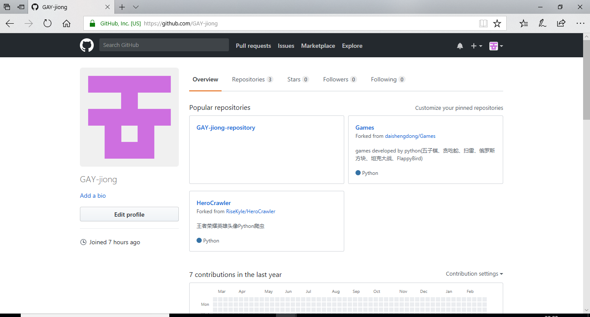

# 
软件工程作业一
                                                                            03015324 张泂
##  1.个人Github账户 
&emsp;&emsp;Name:GAY-jiong

&emsp;&emsp;Email:zhangjiong1997@163.com

&emsp;&emsp;Github账户主页面截图

***
## 2.Github简介
> gitHub是一个面向开源及私有软件项目的托管平台，因为只支持git 作为唯一的版本库格式进行托管，故名gitHub。

>gitHub于2008年4月10日正式上线，除了git代码仓库托管及基本的 Web管理界面以外，还提供了订阅、讨论组、文本渲染、在线文件编辑器、协作图谱（报表）、代码片段分享（Gist）等功能。目前，其注册用户已经超过350万，托管版本数量也是非常之多，其中不乏知名开源项目 Ruby on Rails、jQuery、python 等。

>一个拥有143万开发者的社区。其中不乏Linux发明者Torvalds这样的顶级黑客，以及Rails创始人DHH这样的年轻极客。 
这个星球上最流行的开源托管服务。目前已托管431万git项目，不仅越来越多知名开源项目迁入GitHub，比如Ruby on Rails、jQuery、Ruby、Erlang/OTP；近三年流行的开源库往往在GitHub首发，例如：BootStrap、Node.js、CoffeScript等。 
alexa全球排名414的网站。

### Github优点

**1.版本库本地化，支持离线提交，相对独立不影响协同开发。**
每个开发者都拥有自己的版本控制库，在自己的版本库上可以任意的执行提交代码、创建分支等行为。例如，开发者认为自己提交的代码有问题？没关系，因为版本库是自己的，回滚历史、反复提交、归并分支并不会影响到其他开发者。

**2.更少的“仓库污染”**
git对于每个工程只会产生一个.git目录，这个工程所有的版本控制信息都在这个目录中，不会像SVN那样在每个目录下都产生.svn目录。

**3.把内容按元数据方式存储，完整克隆版本库。**
所有版本信息位于.git目录中，它是处于你的机器上的一个克隆版的版本库，它拥有中心版本库上所有的东西，例如标签、分支、版本记录等。

**4.支持快速切换分支方便合并，比较合并性能好。**
在同一目录下即可切换不同的分支，方便合并，且合并文件速度比SVN快。

**5.分布式版本库，无单点故障，内容完整性好。**
内容存储使用的是SHA-1哈希算法。这能确保代码内容的完整性，确保在遇到磁盘故障和网络问题时降低对版本库的破坏。

***

## 3.课程Home、PyRankine和SEUIF97仓库简介

**1.课程Home**

&emsp;&emsp;这部分内容包括**软件的安装环境,此学期上课的课件及所需资料，本学期课程安排**

**2.PyRankine**

&emsp;&emsp;这部分内容为郎肯循环，是我们专业一个重要的内容，也是我们专业学习和研究的基础，PyRankine仓库主要介绍如何利用Python语言模拟和计算郎肯循环，数据结构+算法=程序或者计算思维。仓库中文件主要介绍了计算思维和编程技巧，通过一步一步拆分讲解的方式，并且给出了郎肯循环的一个编程示例和许多参考网站和教程。

**3.SEUIF97**

&emsp;&emsp;SEUIF97仓库是东南大学开发者开发的水和水蒸气性质的计算模型共享库，基于IAPWS-IF97，使用Python语言编写，以便我们以后在工程实际中用来模拟水和水蒸气的热力性质，提高水和水蒸气性质的计算速度。仓库中的文件主要介绍了在windows和Linux环境下的使用方法，给出了很多DEMO程序，可供交互学习，是一个开源的仓库。

